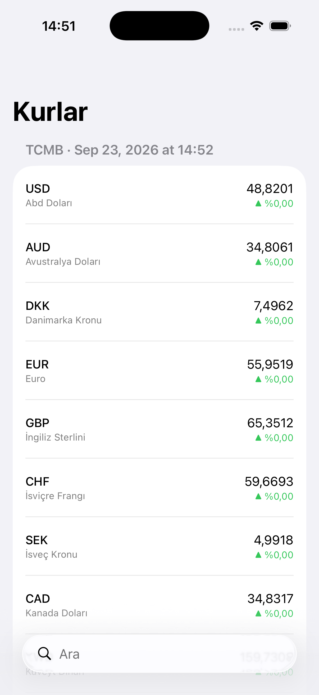
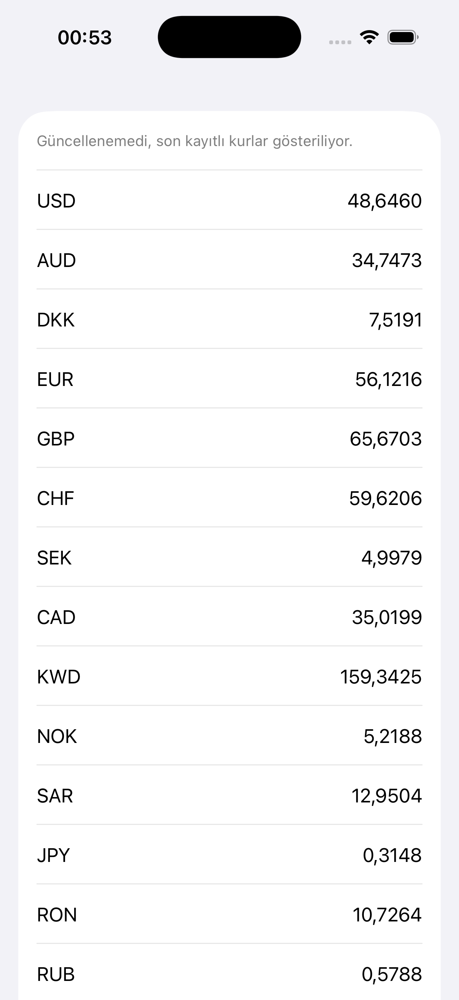
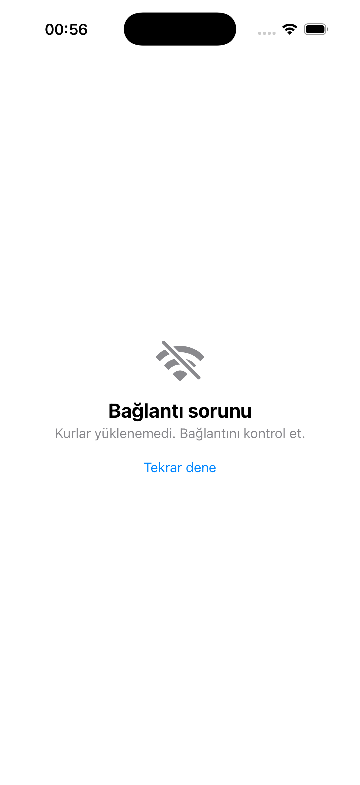

# KurTakip

TCMB verisiyle çalışan iOS döviz kuru uygulaması. SwiftUI ile geliştiriliyor.

  
  
  

## Durum

🚧 Geliştirme aşamasında. Şu an çalışan: kur listesi (isim, fiyat, önceki kura göre
değişim yüzdesi), arama, TCMB bağlantısı, XML çözümleme, çevrimdışı erişim,
yükleniyor ve hata durumları, birim testleri.

## Yapı

- `RateService` — TCMB'den veriyi indirir, HTTP durumunu kontrol eder
- `RateParser` — gelen XML'i Rate nesnelerine çevirir (kod, isim, satış fiyatı)
- `RatesCache` — kurları diske JSON olarak kaydeder ve okur
- `RatesViewModel` — ekran durumunu yönetir (veri, yükleniyor, hata, son güncelleme
  zamanı); yeni veri gelince cache'teki eski fiyatla karşılaştırıp değişim
  yüzdesini hesaplar
- `RateRow` — tek bir kur satırının görünümü (kod, isim, fiyat, değişim rozeti)
- `ContentView` — başlık, arama çubuğu ve listeyi bir araya getirir, sadece görüntüler
- `KurTakipTests` — ViewModel testleri

Ekran kodu verinin nereden geldiğini bilmiyor. ViewModel de XML diye bir
şeyin varlığından habersiz. Her katman yalnızca bir alt katmanı tanıyor.

Ağ ve önbellek katmanları protokol arkasında. ViewModel ne TCMB'yi tanıyor
ne dosya sistemini; sadece "kur getiren bir şey" ve "kaydeden bir şey"
olduğunu biliyor.

## Testler

ViewModel katmanı için birim testleri var. Ağ ve önbellek bağımlılıkları
protokol arkasında olduğu için testler sahte uygulamalarla çalışıyor,
internete ve diske hiç dokunmuyor.

Her commit'te GitHub Actions üzerinde otomatik çalışıyorlar.

## Karşılaştığım sorunlar

**Parser sessizce boş liste döndürüyordu.** Delege metodunun imzasında
`namespaceURI` parametresi eksikti. Swift bunu ayrı bir fonksiyon olarak
derliyor, XMLParser da tanımadığı için hiç çağırmıyordu. Derleme hatası
vermediği için `print` ile akışı adım adım izleyerek buldum.

**404 hatası sessizce boş ekrana dönüşüyordu.** URLSession yalnızca ağ
seviyesindeki hataları fırlatıyor; sunucunun 404 dönmesi başarılı bir istek
sayılıyor ve gelen HTML sayfası parser tarafından boş liste olarak
çözülüyordu. Sonuç: kullanıcı hiçbir açıklama olmadan bomboş bir ekran
görüyordu. HTTP durum kodunu ve çözümleme sonucunu ayrı ayrı kontrol
ederek her iki durumu da hata olarak ele aldım.

**Japon Yeni 100 birim üzerinden kote ediliyor.** TCMB `<Unit>100</Unit>`
gönderiyor. Bölme yapılmazsa yen 30 lira görünüyor, gerçek değeri 0,30.

**Bazı para birimlerinde fiyat boş geliyor.** XDR'nin `ForexSelling` alanı
boş. `Double("")` nil döndürdüğü için bu kayıtları listeye hiç eklemiyorum.

**Testin yakaladığı bir tasarım hatası.** Ağ katmanını protokole çevirirken
önbellek katmanını atlamıştım. İki test aynı disk dosyasını paylaştığı için
ikinci test, birincinin bıraktığı veriyi okuyup kalıyordu. Önbelleği de
protokole çevirince her test kendi bellek içi kopyasıyla çalışır hale geldi.

**Değişim yüzdesi rozeti hiç çıkmıyordu, `previousSelling` doluyken bile.**
`Rate.change` içinde sıfıra bölmeyi engellemek için yazdığım guard yanlışlıkla
`previousSelling != selling` olmuştu, olması gereken `previousSelling != 0`'dı.
TCMB günde bir kez kur yayınladığı için aynı gün içinde `previousSelling` ve
`selling` her zaman eşit çıkıyor, guard da bunu "geçersiz" sayıp `nil`
döndürüyordu — tam da test ettiğim %0 değişim senaryosunu engelliyordu.
ViewModel'e geçici `print`'ler, sonra `RateRow`'a geçici ham veri yazdırarak
`previousSelling`'in doğru geldiğini ama `change`'in hep `nil` çıktığını
görünce buldum.

**Kur adları hep boş geliyordu.** Parser'daki switch'e `<Isim>` elementini
okuyacak case'i eklerken Türkçe klavyeyle yanlışlıkla noktalı büyük `İ`
yazmışım (`case "İsim":`), XML'deki eleman adıysa düz `I` ile `Isim`. Swift
string karşılaştırması Unicode karakter karakter yaptığı için ikisi hiç
eşleşmiyordu, `name` hep `""` kalıyordu.

**Model'e yeni alan eklemek projeyi anlık olarak kırdı.** `Rate`'e `name`
eklediğimde onu üreten `RateParser` ve test dosyasındaki sahte veriler
güncellenene kadar proje derlenmedi — beklenen bir ara durumdu. Ayrıca `Rate`
`Codable` olduğu için diskteki eski cache dosyası yeni alanla decode
edilemedi; `RatesCache.load()` `try?` sayesinde sessizce `nil` döndürüp
ağdan taze veri çekilmesini sağladı — kendi kendine iyileşen bir durum.

## Kararlar

**Cache-first veri akışı.** Uygulama açılışında önce diskteki son kayıtlı
kurlar gösteriliyor, ağ güncellemesi arkadan geliyor. Ağ hatası durumunda
elde veri varsa hata ekranı yerine küçük bir uyarı satırı çıkıyor —
eski veri, hiç veri olmamasından iyi.

**Değişim yüzdesi neden ağa ekstra istek atmadan hesaplanıyor.** TCMB'nin
bugünkü XML'i sadece o anki kuru veriyor, dünün kuru için ayrı bir arşiv
isteği atmak gerekirdi. Bunun yerine `RatesCache`'in zaten tuttuğu bir
önceki kur ile karşılaştırıyorum — ekstra ağ trafiği yok, mevcut cache-first
mimariye uyuyor. Bedeli: uygulama ilk açıldığında veya cache boşken değişim
gösterilemiyor, o durumda rozet hiç çizilmiyor.

**Kur adları için Türkçe locale'e özel capitalize.** TCMB `<Isim>ABD
DOLARI</Isim>` gibi tamamen büyük harfle veriyor. Düz `.capitalized`
kullansaydım Türkçe'deki noktasız `ı` kuralını yanlış uygulardı,
`.capitalized(with: Locale(identifier: "tr_TR"))` kullandım.

**Neden JSON dosyası, neden SwiftData değil.** Veri küçük (20 kayıt,
iki alan) ve ilişkisel değil. SwiftData'nın kurulum maliyeti bu boyutta
bir veri için getirisinden fazlaydı. Codable ile JSON'a çevirip
Caches klasörüne yazmak yeterli oldu.

**Neden Caches klasörü.** iOS depolama azaldığında bu klasörü silebiliyor.
Kur verisi için doğru tercih, çünkü kaybolsa da yeniden indirilebilir.
Kullanıcının kendi verisi olsaydı Documents klasörü kullanılırdı.

**Testler neden sahte servisle çalışıyor.** Gerçek servisle test yazmak
internete bağımlı olurdu: bağlantı yoksa test kalır, TCMB yavaşsa test
yavaşlar, hafta sonu farklı sonuç verirdi. Bağımlılıkları protokol arkasına
alıp testlerde sahte uygulamalarını veriyorum. Testler milisaniyeler içinde
bitiyor ve her seferinde aynı sonucu veriyor.

## Sırada

- Detay ekranı ve grafik
